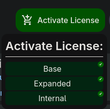
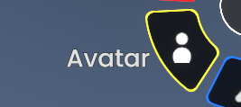
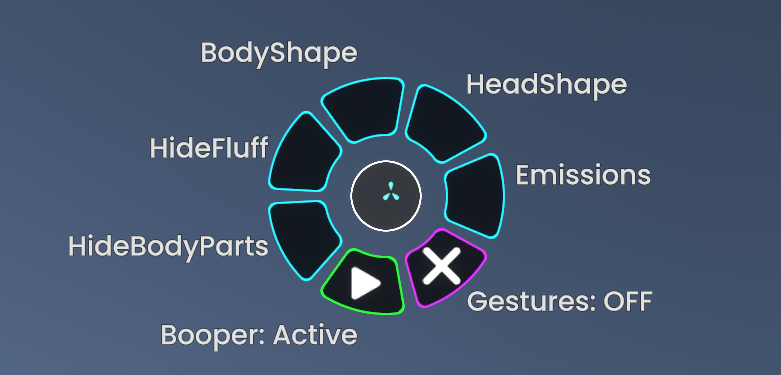
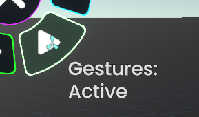
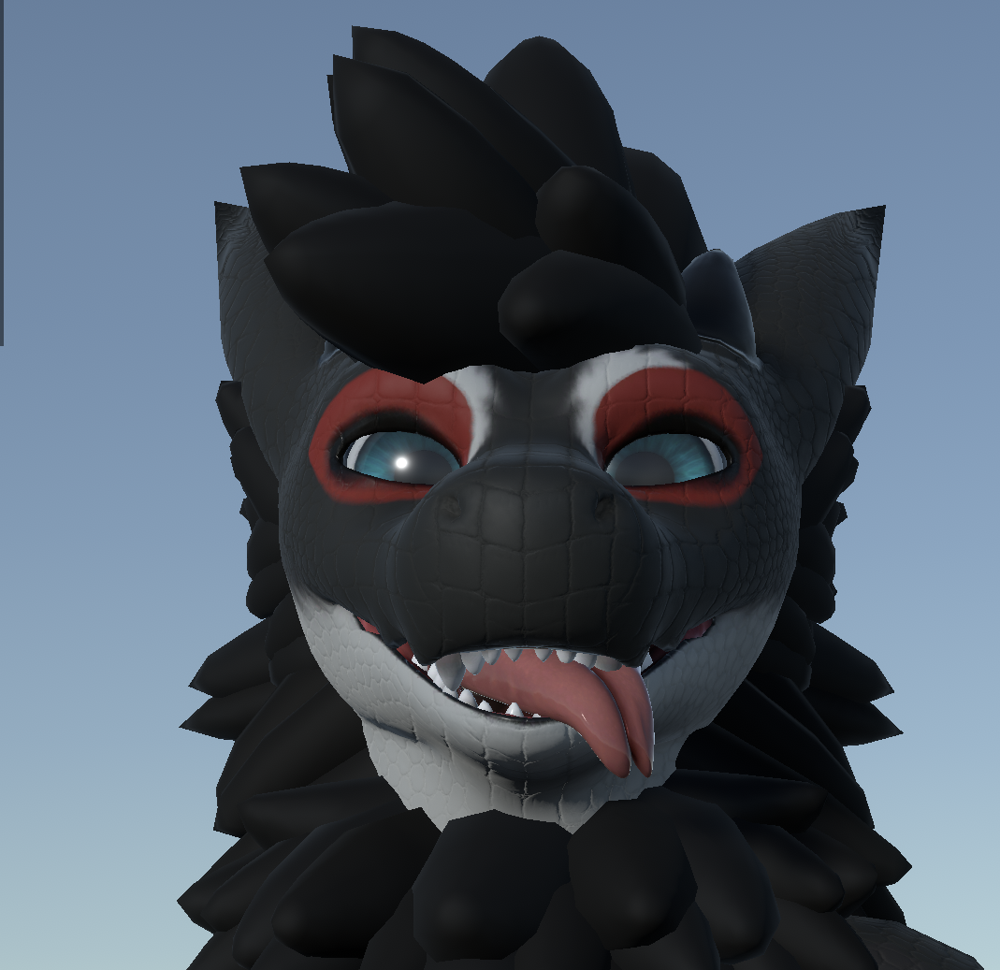
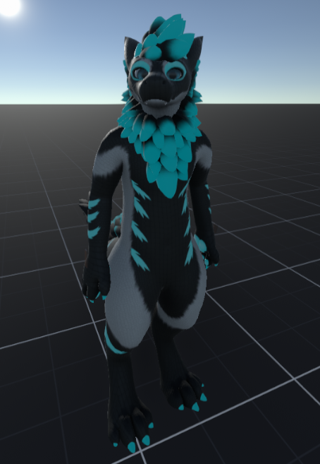
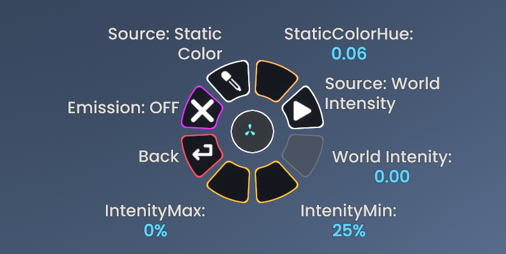
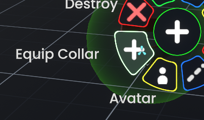
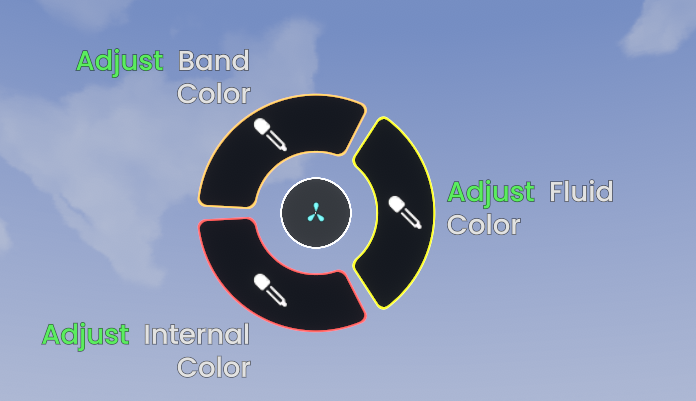

<!-- markdownlint-disable MD033 -->

# Resonite

> [!Important]
> This guide is tailored more towards newcomers to Resonite. If you are already experienced with the game, the more avatar-specific parts can be found here:
>
> - [Distribution and Installation](#distribution-and-installation) 1.-11.
> - [General Info](#general-info)
> - [Gesture control](#gesture-control)
> - [Clothing and Add-ons](#clothing-and-add-ons)
>
> If you are new to Resonite, it is recommended to read the whole guide to also get started with some of the basics.
>
> Keep in mind, that this Resonite-Port - including the Addons - are community driven. If you run into bug or inconsistencies you would like to report, please see [Credits and Maintainers](#credits-and-maintainers) and not Sweetwater.

<!-- panels:start -->
<!-- div:title-panel -->
## Distribution and Installation

<!-- div:left-panel -->
1. Join [Sweetwaters Discord Server](https://swaggon.gay/discord)
2. Go to [Uni-VCC](https://uni-vcc.app/)
3. Login with your Discord.
   1. If you already have an account, make sure you link your Discord account with it.
4. Navigate to the [Uni-VCC Swaggon Package](https://uni-vcc.app/packages/gay.swaggon)
5. Activate your license with the green button for the package that you have bought (Base, Expanded, Internal).
6. When the menu shows a green checkmark you can head to Discord to get the package.
7. Discord Channels:
   1. [#res-swaggon-base](https://discord.com/channels/1332560042347593889/1463725264176549941)
   2. [#res-swaggon-expanded](https://discord.com/channels/1332560042347593889/1463725423341862964)
   3. [#res-swaggon-full](https://discord.com/channels/1332560042347593889/1463725507005780018)
8. Grab the Resonite package of the avatar and accessories you want to use in Resonite.
   1. **Keep in mind that the full-avatar should not be used in public sessions!**
9. Drag n' Drop the Resonite Package into the game.
10. Wait for the import to complete and adjust any settings you want.
11. If you are happy, hold down on "Import Avatar" button at the bottom.
12. You should be able equip the avatar now through your context menu
13. Make sure to save it to your inventory to use it later.

<!-- div:right-panel -->

<!-- panels:end -->

## General Info

All settings on the Installer can be changed in the [Context Menu](#context-menu) down the line.
Textures have to be changed with a inspector and will not be explained in detail in this guide.

## Context Menu

<!-- panels:start -->
<!-- div:title-panel -->
### Accessing the avatar menu

<!-- div:left-panel -->

<!-- div:right-panel -->
The avatar settings can be pressing "Avatar" in the context-menu. All options are saved on the avatar, so make sure to save it to your inventory after adjusting to your needs.
<!-- panels:end -->

<!-- panels:start -->
<!-- div:title-panel -->
### Options

<!-- div:left-panel -->
- Toggles and avatar settings
  - Booper: Toggles the avatar booper
  - Gestures: Enable Keyboard or Controller face-gestures [(More details below)](#gesture-control)
  - HideBodyParts: Required for some clothing options
  - HideFluff: Hides parts of the fluff
  - BodyShape: Customizes different blend-shapes of the body
  - HeadShape: Customizes different blend-shapes of the head
  - Emissions: Changes [emission colors](#texture-emissions) of the fluff and parts of the body

<!-- div:right-panel -->

<!-- panels:end -->

<!-- panels:start -->
<!-- div:title-panel -->
### Changing number values

<!-- div:left-panel -->

<!-- div:right-panel -->
To change number values you click and drag in a circular motion to not accidentally close the context menu.
<!-- panels:end -->

<!-- panels:start -->
<!-- div:title-panel -->
## Gesture control

<!-- div:left-panel -->
Make sure to enable "Gestures" in your context-menu to use them.

Gestures stay in their last state, when you deactivate them.

<!-- div:right-panel -->

<!-- panels:end -->

<!-- panels:start -->
<!-- div:title-panel -->
### VR

<!-- div:left-panel -->
In VR these are mapped to your controller.
<!-- Since every controller has a different layout, we won't go into detail for all of them, but you can use the gesture-tester provided here: `couldn't find the link` -->

### Desktop

Unlike in VRChat, the function-keys (<kbd>F1</kbd>-<kbd>F12</kbd>) are already used by the game. Instead, you need to use <kbd>&nbsp;&nbsp;&nbsp;⇧</kbd> and the Num-Pad.

Left and right <kbd>&nbsp;&nbsp;&nbsp;⇧</kbd> do different face gestures and can be combined.

<!-- div:right-panel -->

<!-- panels:end -->

## Texture Emissions

Emissions are used to express yourself even more or make your textures bob to the music.
The color source and the intensity might not work, if set to "World" and the world is not supporting it.#
<!-- panels:start -->
<!-- div:right-panel -->

<!-- div:left-panel -->

<!-- panels:end -->

<!-- panels:start -->
<!-- div:title-panel -->
## Clothing and Add-ons

<!-- div:left-panel -->
To keep the avatar lightweight, it doesn't come with any clothing pre-added. Instead, we offer all clothing parts and avatar add-ons as separate "orbs", which you can also download from Discord.

You can equip these orbs through the context menu, while holding it or grabbing and putting them onto yourself. More in depth installation and usage instructions are described below.

<!-- div:right-panel -->

<!-- panels:end -->

### Vore Addon

<!-- tabs:start -->

#### **Info**

> [!Note]
> This can only be used with the "Swaggon-Internal" Avatar!
>
> The Vore system is considered 18+ Please confirm your age above by switching to second tab.

### **I'm over the age of 18.**

#### General

The System that is being used here is called the Expandable Vore System (EVS) together with a custom orb. We chose to use it over a custom system in order to benefit from compliance, security and feature updates as well as compatibility for existing systems in Resonite.

#### Features

- Blendshapes animations
- Internal color adjustments
- Additionally with EVS
  - Custom Swaggon belly support
  - Swallow animation

<!-- panels:start -->
<!-- div:title-panel -->
#### How to install

<!-- div:left-panel -->
1. Spawn out the Orb from the Respack
2. Save the folder attached to the platform to your Inventory
3. Install the "Swaggon Vore Addon" as described in a previous step
4. Adjust your internal, fluid and band color from the addons-menu
5. Save your modified avatar
6. Equip the EVS-Band of your choice from the folder you saved in step 2
   1. Keep in mind that the EVS-Band can only be spawned in hidden/private sessions

:arrow_right: When using it again, you only need to equip your avatar and repeat step 6.

<!-- div:right-panel -->

<!-- panels:end -->

> [!Important]
>
> - Best practice is to have a separate copy for 18+ shenanigans.
> - Do not save the avatar with the EVS-Band equipped. This makes your avatar heavy!
>   - The Vore-Addon-Orb can stay.
> - Do not use the EVS Installer. This will partially break the orb.

<!-- tabs:end -->

## Known issues

- Custom emissive texture option (Hair + Internals) doesn't turn on the emissions by default
  - Should turn on, if custom texture is loaded
- Hair texture setup missing in importer
- Texture swap for internals currently not possible
- Cant change internal color for Maw-Only version

## Current version, Credits and Maintainers

Version: `v1.3-R1.0`

If you find any bugs or inconsistencies, please reach out to `the.phil.` on Discord.

- Avatar & Clothing: **Nordwick**
- Internals & Vore System integration: **Axiom Wolf**
- Coordination & Docs: **Phil**
- Special Thanks: **Zeith**
